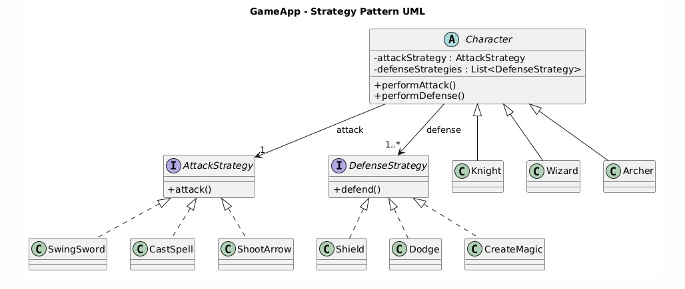

# 🎮 GameApp – Strategy Pattern Implementation

---

## 📌 Overview
This project demonstrates the use of the **Strategy Design Pattern** in a simple game application.  
Different game characters (Knight, Wizard, and Archer) have varying attack and defense behaviors, which are implemented using interchangeable strategy objects instead of conditional logic.

---

## 🧩 Problem Statement

Suppose we have three types of characters in a GameApp:

1. **Knight**
   - Attacks with a sword
   - Uses three defense strategies:
     - Shield
     - Dodge
     - Magic Barrier

2. **Wizard**
   - Casts spells
   - Uses Magic Barrier to defend

3. **Archer**
   - Shoots arrows
   - Uses Dodge to defend

### Required Strategy Types

**A. DefenseStrategy**
- Shield  
- Dodge  
- CreateMagic  

**B. AttackStrategy**
- CastSpell  
- ShootArrow  
- SwingSword  

The original implementation used multiple `if-else` statements inside the `Character` class to determine attack and defense behaviors. This approach makes the code difficult to maintain and extend.

The goal is to **refactor the code using the Strategy Design Pattern** and represent the design using a UML diagram.

---

## 🎯 Solution Approach

The **Strategy Pattern** is used to encapsulate attack and defense behaviors into separate strategy classes.  
Each character is composed of:
- One **AttackStrategy**
- One or more **DefenseStrategy** objects

This design removes conditional logic and allows behaviors to be modified or extended without changing existing classes.

---

## 🏗️ Design Structure

### Strategy Interfaces
- `AttackStrategy`
- `DefenseStrategy`

### Concrete Strategies

**Attack Strategies**
- `SwingSword`
- `CastSpell`
- `ShootArrow`

**Defense Strategies**
- `Shield`
- `Dodge`
- `CreateMagic`

### Characters
- `Knight`
- `Wizard`
- `Archer`

Each character assigns its specific attack and defense strategies during initialization.

---

## 📐 UML Diagram
The UML diagram above illustrates:
- Strategy interfaces and their concrete implementations
- The abstract `Character` class
- One-to-one relationship with `AttackStrategy`
- One-to-many relationship with `DefenseStrategy`
- Inheritance relationships for character types

---

## ✅ Benefits of the Refactored Design

- Eliminates complex `if-else` conditions
- Follows the **Open–Closed Principle**
- Supports multiple defense strategies
- Easy to extend and maintain
- Promotes **composition over inheritance**

---

## 🚀 How to Run

1. Compile all `.java` files
2. Run the `GameApp` class containing the `main()` method
3. Observe each character performing its assigned attack and defense strategies

---

## 📚 Design Pattern Used
**Strategy Design Pattern**

---

✍️ *This project demonstrates clean object-oriented design and proper use of behavioral design patterns in Java.*
